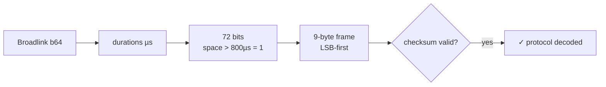

# Daikin RB2CA1 — IR Protocol Reverse-Engineered

The Daikin **RB2CA1** remote (India, e.g. paired to FTKZ50UV16U4) speaks an
**undocumented 72-bit protocol** that exists in *no* IR library. This repo
cracks it from ~20 Broadlink captures and **generates every command
programmatically** — no manual learning of the ~91 temp × fan combinations.

```
Captures (20) → protocol cracked → 93 commands generated → tested on real AC ✓
```

- ✅ checksum formula recovered, validates **21/21** captures
- ✅ every capture regenerates **byte-identically** from its decoded state
- ✅ generated codes sent via Broadlink RM4 — **AC obeys**
- 📦 ready-made outputs: [`codes.json`](codes.json) (Broadlink/HA) and
  [`smartir.json`](smartir.json) ([SmartIR](https://github.com/smartHomeHub/SmartIR) climate profile)

Python 3 stdlib only. No dependencies.

---

## The problem

Home Assistant + Broadlink users normally *learn* every command by hand.
This remote needs 13 temperatures × 7 fan modes + on/off ≈ **92 learns**.
Full-state IR protocols (every button press sends the entire AC state) make
this worse: you can't learn "just the temp button".

Instead: learn a **small controlled set**, reverse the frame, generate the rest.

## How it was cracked

### Step 1 — Decode the Broadlink captures

Broadlink "learned" Base64 packets aren't timings; they're a compressed format
(same codec as [python-broadlink](https://github.com/mjg59/python-broadlink)):

| bytes | meaning |
|---|---|
| `0x26` | IR marker |
| 2 bytes | encoded body length (LE) |
| body | per pulse: `us ÷ 32.84`; if ≥ 256 emit `0x00` escape + high byte, then low byte |

Each capture decoded to **148 durations**: one header pair, 72 bit pairs, a
footer mark, and a ~109 ms trailing gap → a **single 9-byte frame**, sent once.

### Step 2 — Extract bits

Pulse-distance encoding: every mark ≈ 450 µs, space = 450 µs (0) or 1300 µs (1).
Bytes are sent **LSB-first** (standard Daikin style).



### Step 3 — Rule out every known Daikin protocol

Checked all 10 Daikin decoders in
[IRremoteESP8266](https://github.com/crankyoldgit/IRremoteESP8266):

| Protocol | Frame | Verdict |
|---|---|---|
| DAIKIN / 2 / 312 | 35–39 B, multi-section | ✗ |
| DAIKIN 64 / 128 / 152 | 8–19 B, different headers & bit timing | ✗ |
| DAIKIN 160 / 176 / 200 / 216 | 20–27 B, 2 sections | ✗ |

Nearest relative: **DAIKIN216** bit timing (420/450/1300 µs ≈ ours) — but it's
a 27-byte two-section frame vs. our single 9-byte frame with a ~2× header.
Conclusion: **new protocol**, derived purely from the captures. We call it
**Daikin72**.

### Step 4 — Map the fields by differential analysis

Two controlled sweeps against a base capture, changing **one thing at a time**:

- **temperature sweep** (22/23/24 °C, same fan) → only byte 3 moved → temp field
- **fan sweep** (auto/1–5/turbo, same temp) → only byte 2 moved → fan/power/turbo

Resulting layout:

| Byte | Role | Encoding |
|---|---|---|
| 0–1 | sync | `AA 11` constant |
| 2 | **fan + power + powerful** | `turbo<<7 \| fan<<4 \| power<<3 \| 1` (fan: auto=0, 1–5) |
| 3 | **temperature** | `temp − 16` (18–30 °C → 2–14) |
| 4–7 | mode/flags | `01 44 00 00` constant in all captures (Cool mode) |
| 8 | **checksum** | see below |

### Step 5 — Crack the checksum (the hard part)

Byte 8 tracked the varying bytes, but nothing simple fit. Each dead end taught
something:

| Hypothesis | Result |
|---|---|
| `ck = sum(bytes)` | ✗ |
| `ck = xor(bytes)` / nibble sums | ✗ |
| any CRC-8 (poly × init × reflect × xorout, both byte orders, all ranges) | ✗ — provably not GF(2)-linear |
| linear in decoded fields | ✗ — deltas cycle with a temp-dependent phase |

The nonlinearity pattern (temps 23/24 share the high nibble, 22 differs;
fan deltas rotate) pointed at **nibble carries**. Decomposing nibble-by-nibble:

```
lo   = (b3 + (b2 & 0x0F)) & 0xF      ; low-nibble sum
ck   = ( (b2 >> 4) + (lo >> 4) ) << 4 | lo ^ ...   ← collapses beautifully:
```

**`ck = (b2 + b3) ^ 0xAA`** — and the `0xAA` isn't magic: the four constant
bytes `AA 11 01 44` sum to exactly `0x100 ≡ 0 (mod 256)`, so the general rule is

```
ck = ( sum(bytes[0:8]) mod 256 ) ^ 0xAA
```

which explains every observed carry quirk. **Valid on all 21 valid captures.**

### Step 6 — Validate end to end

1. All 21 captures decode with a valid checksum and the expected state.
2. All 21 regenerate **byte-identically** from their decoded state.
3. Generated 25 °C codes sent through the actual Broadlink → **AC obeys**.

## Curious findings

- `24_2` had been learned at **fan 4** — the label was wrong, not the capture.
- The remote **resets to 24 °C on shutdown**: off-frames always carry 24,
  even when powered off at 23 (matches the display behaviour).
- `power_on`/`power_off` captures had the **powerful (turbo) bit** latched from
  an earlier press.
- One capture (`23_auto`) was a truncated learn — harmless, everything else
  covers it.

## Usage

```bash
git clone https://github.com/adityasanehi/daikin-rb2ca1-ir-reverse.git
cd daikin-rb2ca1-ir-reverse
python3 generate.py   # validates protocol vs captures.json, writes codes.json
python3 smartir.py    # writes smartir.json (SmartIR profile)
python3 daikin.py     # module self-check
```

| File | What it is |
|---|---|
| [`captures.json`](captures.json) | the raw Broadlink base64 captures (the evidence) |
| [`broadlink.py`](broadlink.py) | Broadlink learned-code codec (b64 ⇄ µs timings) |
| [`daikin.py`](daikin.py) | the protocol: fields, checksum, timing, build/decode |
| [`generate.py`](generate.py) | capture validation + full command matrix |
| [`smartir.py`](smartir.py) | SmartIR profile generator |
| [`codes.json`](codes.json) | 93 commands: `on`, `off`, `18_auto`…`30_turbo` |
| [`smartir.json`](smartir.json) | SmartIR climate profile |

### Home Assistant — Broadlink codes

Drop the contents of `codes.json` into your
`broadlink_remote_<id>_codes` storage (restart HA). Then:

```yaml
service: remote.send_command
target: {entity_id: remote.broadlink_remote}
data: {device: adis_bedroom_ac, command: "25_2"}
```

Every code is a full state — `25_2` turns the AC **on** at 25 °C fan 2.
`off` is the only standalone you need.

### Home Assistant — SmartIR thermostat card

Copy `smartir.json` into `<config>/custom_components/smartir/codes/climate/9001.json`
(rename to a free number) and:

```yaml
smartir:

climate:
  - platform: smartir
    name: Bedroom AC
    unique_id: adis_bedroom_ac
    device_code: 9001
    controller_data: remote.broadlink_remote
```

## Timing reference (for library authors)

- 38 kHz carrier, pulse-distance, LSB-first per byte, single frame
- header 7000/3500 µs · bit mark 450 µs · spaces 450 (0) / 1300 (1) µs
- footer mark ~450 µs + ~109 ms gap
- closest known relative: DAIKIN216 bit timing — suggest **DAIKIN72** as the name

## Extending

- **Other modes** (dry/fan/heat) or **swing**: bytes 4–7 carry them. Learn one
  sample per mode at a known temp/fan, diff against a cool frame, re-derive the
  checksum with the general `sum ^ 0xAA` rule. Same method, five minutes each.

## References

- [IRremoteESP8266](https://github.com/crankyoldgit/IRremoteESP8266) — used to *rule out* all known Daikin protocols
- [blafois/Daikin-IR-Reverse](https://github.com/blafois/Daikin-IR-Reverse) — methodology inspiration (ARC470A1)
- [python-broadlink](https://github.com/mjg59/python-broadlink) — learned-code format reference
- [SmartIR](https://github.com/smartHomeHub/SmartIR) — climate profile format

## License

[MIT](LICENSE)
